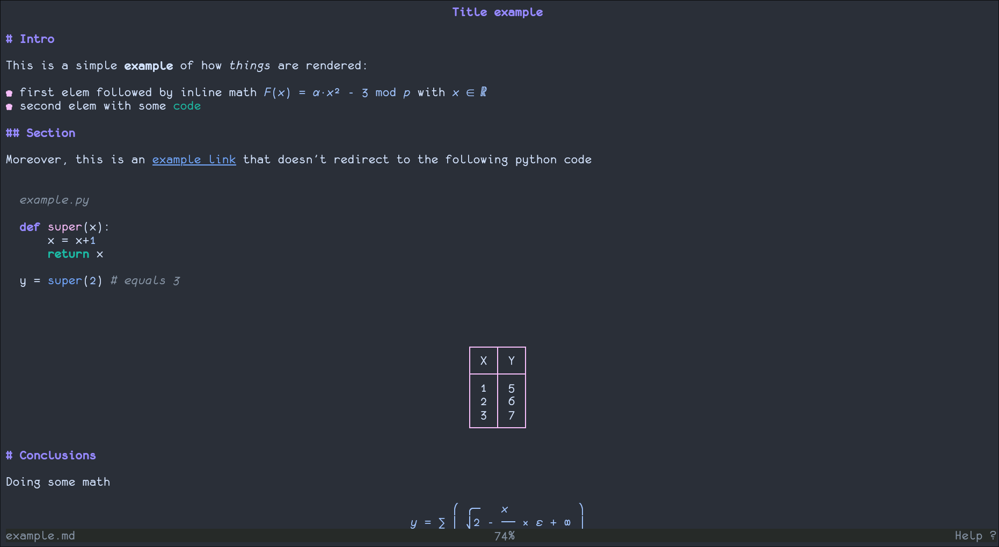
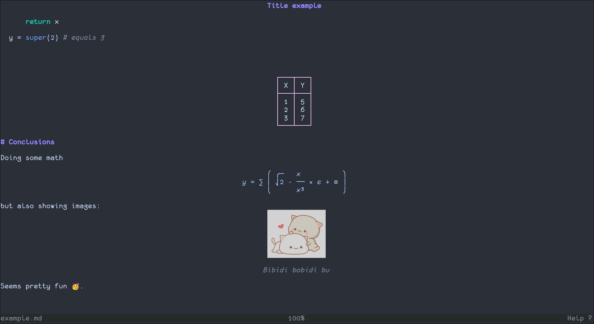
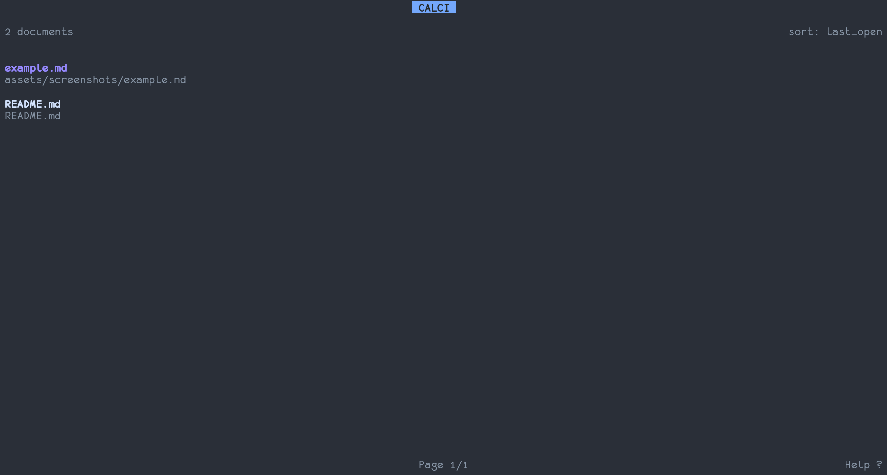
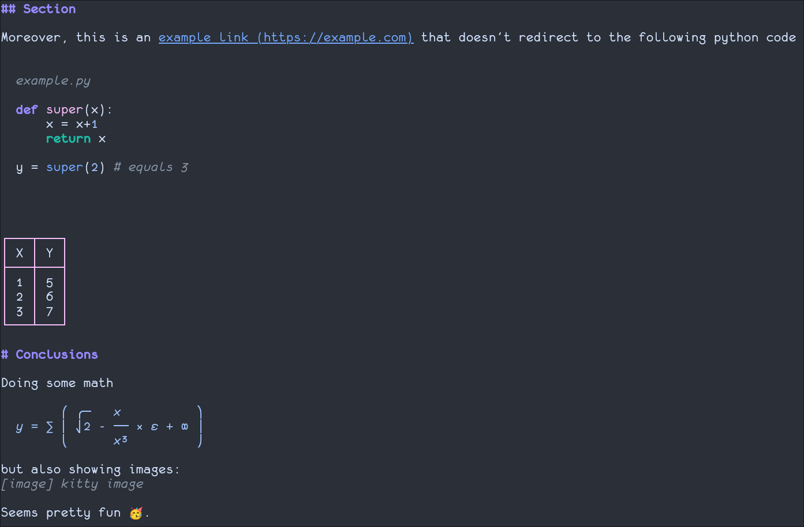

# calci

Rust TUI markdown pager inspired by [Glow](https://github.com/charmbracelet/glow) and heavily modified on my personal needs that integrates math rendering via [Calcifer](https://github.com/Crisis82/calcifer).






## Features

- Dashboard, pager and plain mode
- Text/File search (`/`, `n`, `N`)
- Direct editing (`e`) and reload (`r`)
- Configurable behavior via `config.toml` and colors via `color.toml`
- Jekyll-like front matter header (`--- title: ... ---`) with sticky top title
- Code block rendering with syntax highlighting and title support
- Math rendering through `calcifer` (`$...$`, `$$...$$`)
- Images rendering via Kitty graphics protocol with width support
- Math support in code blocks via escaped markers `\$...\$`
- Copy entire code block to clipboard with `y` or mouse click
- Link opening with `o` or mouse click (optional confirmation popup)
- Centered tables and ASCII drawings
- Markdown formatting support: headings, bold, italic, strikethrough, links, block quotes, lists, code fences, tables
- Typographic smart quotes
- Toggable mouse mode to allow text selection

## Build

```bash
cargo build --release
```

## Usage

```bash
# Pager mode (default)
calci README.md

# Non-pager mode (render to stdout)
calci --plain README.md

# Generate shell completion
calci -c zsh > _calci
```

Completion offers also positional tab suggestion of Markdown files and relative directories that contain Markdown files.

### Config files

Defaults:

- app config is read from `~/.config/calci/config.toml` when present
- colors are read from `~/.config/calci/color.toml` when present
- dashboard open history: `~/.config/calci/dashboard_state.toml`
- dashboard file cache: `~/.config/calci/dashboard_cache.toml`
- `--color <FILE>` overrides the palette file path for the current run

`config.toml` supports:
- `dashboard_sort = "last_open"` (default) or `"last_edited"`
- `dashboard_fuzzy_mode = "loose"` (default) or `"strict"`
- `dashboard_show_edited_age = false` (default)
- `mouse = true` enables dashboard click + wheel gestures and pager mouse actions by default
- dashboard hotkey `s` toggles sort mode (`last_open`/`last_edited`) at runtime

## Keybindings

- `q`: quit
- `j/k`, `↓/↑`: move
- `PgDn/PgUp`, `Space`: page scroll
- `/`: search mode
- `n` / `N`: next / previous match
- `y`: copy selected code block
- `o`: open link on selected line (shows confirm popup)
- mouse click on line with link: open link (when selection mode is off)
- mouse click on code line: copy code block (when selection mode is off)
- `e`: open editor (`$EDITOR`, default `vi`)
- `r`: reload content
- `m`: toggle selection mode (off by default)
- `?`: keybindings popup

### Dashboard search modes

- `loose` (default): in-order fuzzy match with gaps allowed.
  Example: `drm` matches `docs/readme.md`.
- `strict`: contiguous substring only.
  Example: `read` matches `docs/readme.md`, but `drm` does not.

### color.toml format

`Calci` uses a `[base16]` color palette that auto-maps defaults for pager/search/code
For explicit overrides, the following sections can be adjusted:
  - `[pager]` with `text`, `heading`, `quote`, `list_marker`, `link`, `status_fg`, `status_bg`, `cursor_line_bg`, `line_number_fg`
  - `[search]` with `hit_fg`, `hit_bg`, `current_fg`, `current_bg`
  - `[code]` with `inline`, `black`, `grey`, `white`, `purple`, `pink`, `blue`, `cyan`, `green`, `red`, `yellow`, `orange`

## Notes

- Search ignores code/math
- For `e` to work, open from a file path (not stdin)
- Image decoding/fetching is pager-only and only supported via Kitty terminal
